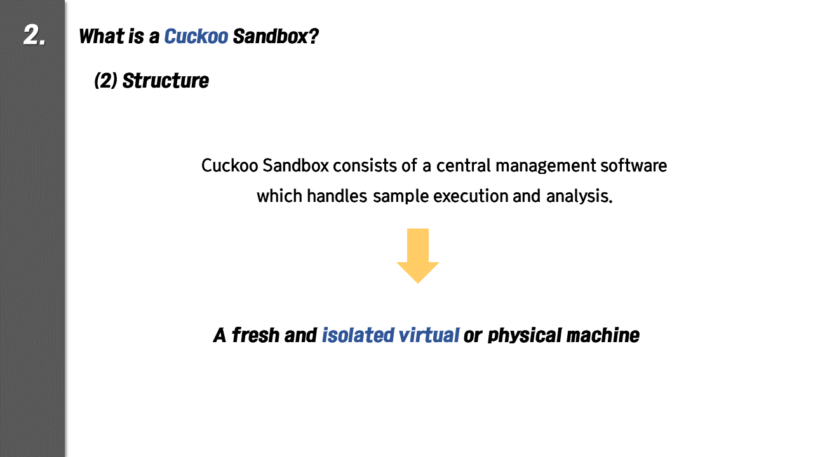
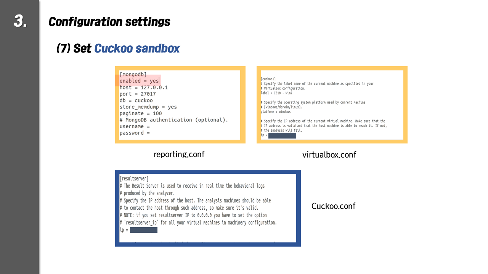

## Dynamic Malware Analysis

1. Comparison between static analysis and dynamic analysis

2. Cuckoo Sandbox

3. Cuckoo Sandbox installation process

4. Dynamic analysis results

5. Classification

6. Member

   [member 1] 
   `name` : Lim Hyo Jin  
   `student number` : 201635844 
   `e-mail` : [hellogenie97@gmil.com](mailto:hellogenie97@gmil.com) 

   [member 2] 
   `name` : Lee Ye Ji 
   `student number` : 201635838 
   `e-mail` : [yagee1997@gmail.com](mailto:yagee1997@gmail.com) 

